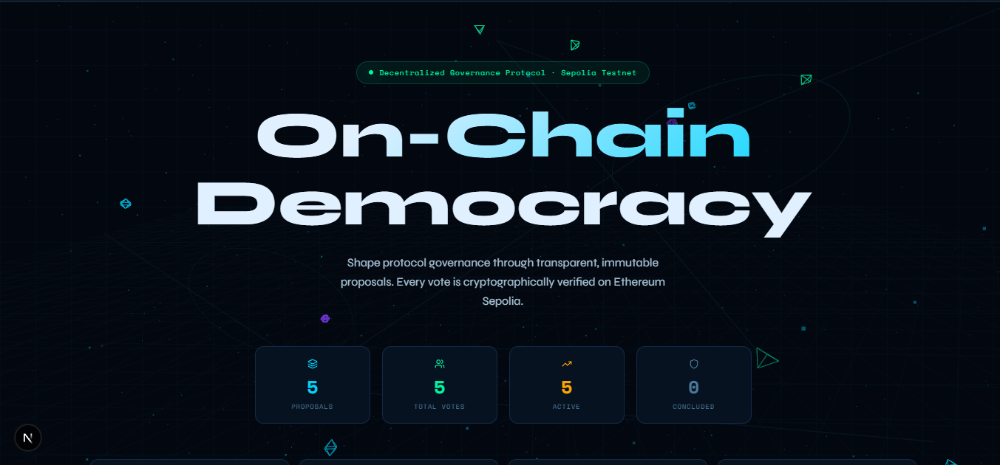
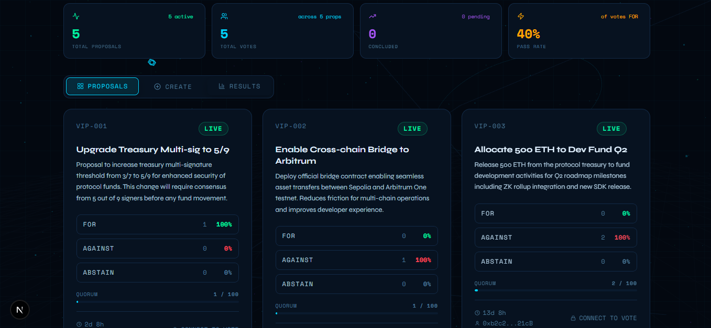
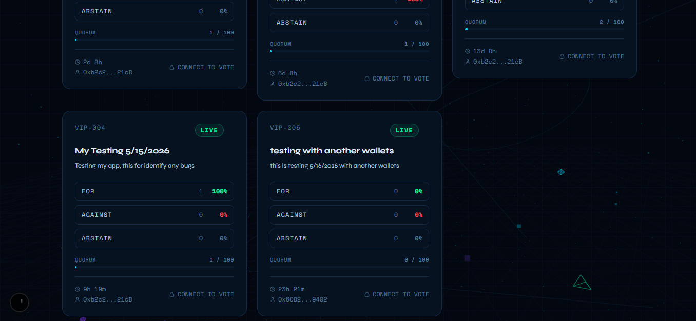
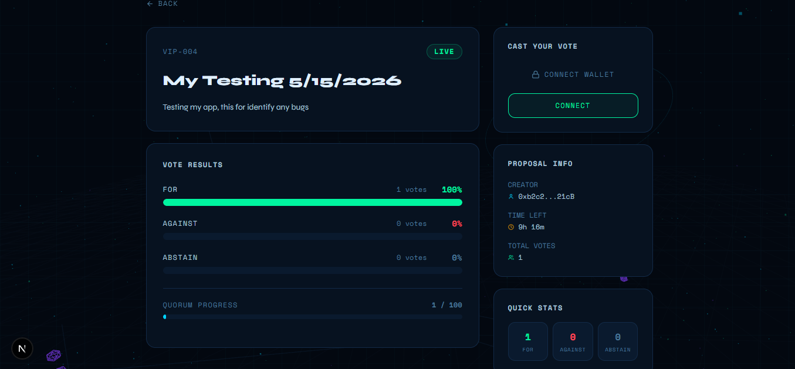
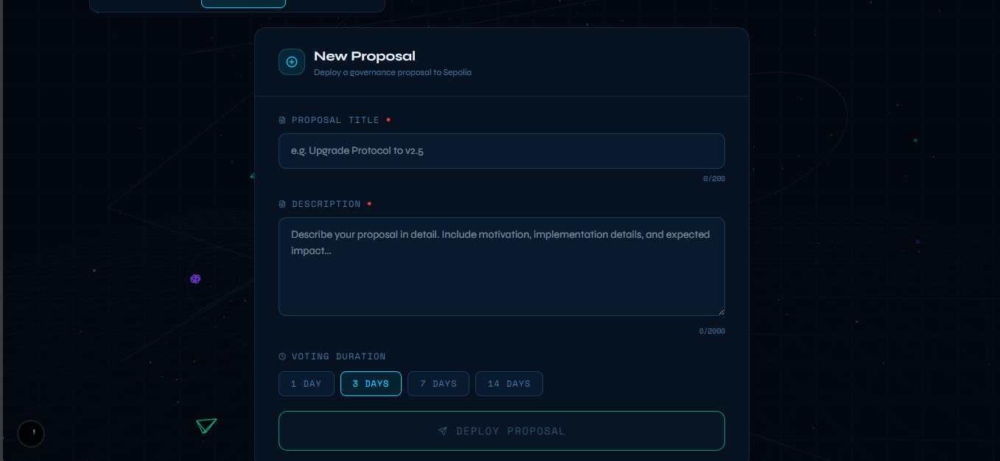
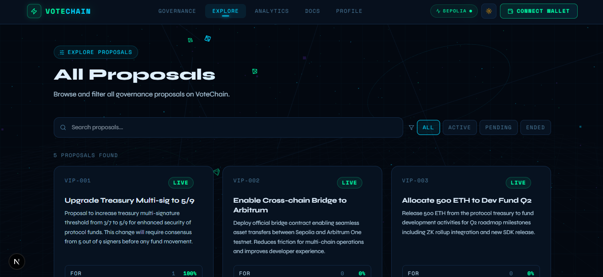
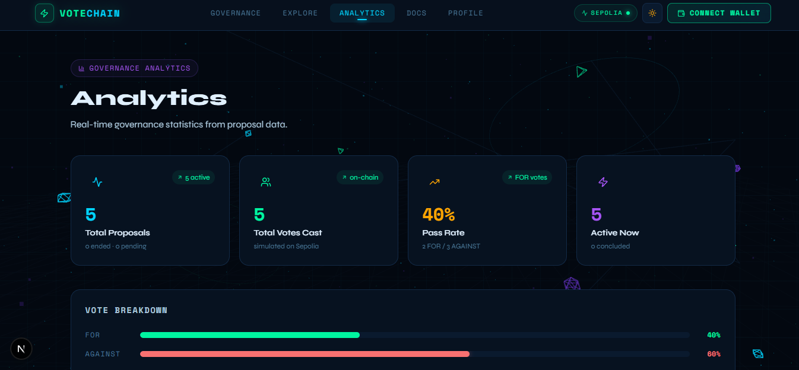
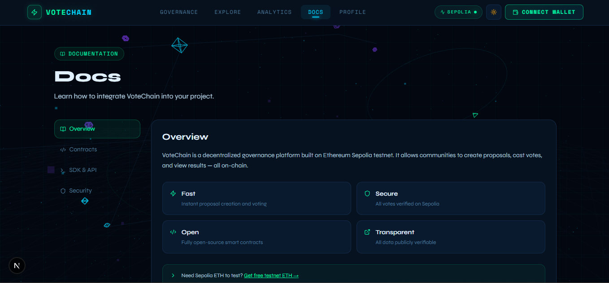
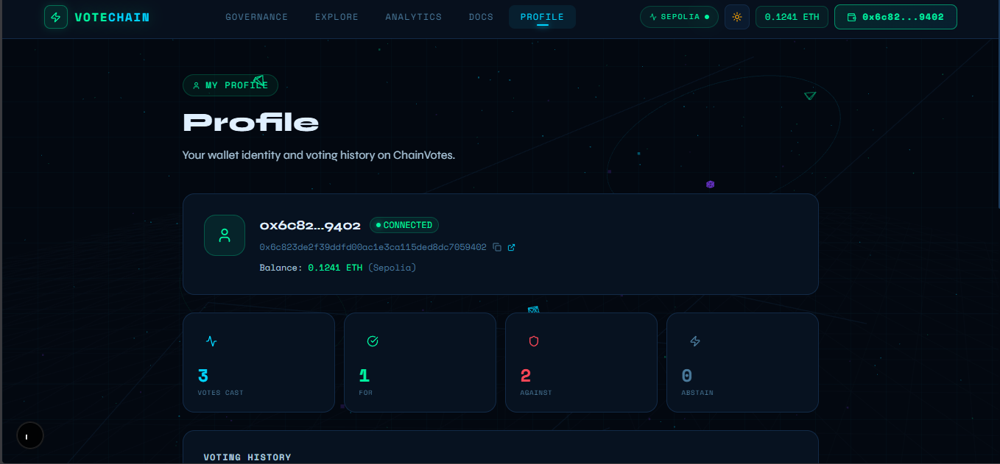

# ChainVotes — Decentralized Governance on Sepolia

> On-chain proposal creation and voting on Ethereum Sepolia — transparent, permanent, and tamper-proof.



🔗 **Live Contract:** [`0xb626C2dFabB8312Dc3d284D8054a3a29Ba2258D3`](https://sepolia.etherscan.io/address/0xb626C2dFabB8312Dc3d284D8054a3a29Ba2258D3)  
👤 **Author:** [@0xrayn](https://github.com/0xrayn)

---

## Screenshots

### Governance — Main Dashboard
The landing page shows live on-chain stats (total proposals, total votes, pass rate) and all active proposals at a glance. No wallet needed to view.



---

### Proposal Card — Vote FOR / AGAINST / ABSTAIN
Each proposal card shows real-time vote counts and percentages. If your wallet is connected and the proposal is active, you can cast your vote directly from the card. Three choices:
- **FOR** — you support the proposal
- **AGAINST** — you oppose it
- **ABSTAIN** — you acknowledge it but choose not to take a side

Every vote is a real on-chain transaction. Once confirmed, it's permanent and cannot be changed.



---

### Proposal Detail — Full View
Clicking a proposal opens the full detail page with the complete description, creator address, time remaining, quorum progress, and the full vote breakdown with a live bar chart. You can also vote from here.



---

### Create Proposal
Any connected wallet can submit a new governance proposal. The form requires a title (min. 10 chars), a description (min. 20 chars), and a voting duration (1, 3, 7, or 14 days). After submitting, the proposal goes live on-chain immediately.



---

### Explore — Search & Filter
The Explore page lets you search proposals by title, description, or ID, and filter by status: ALL / ACTIVE / PENDING / ENDED. Useful when there are many proposals.



---

### Analytics — Governance Stats
Real-time governance statistics pulled directly from the blockchain: total proposals, vote distribution (FOR vs AGAINST vs ABSTAIN), top proposals by participation, and overall pass rate.



---

### Docs — Integration Guide
In-app documentation covering how the smart contract works, how to interact with it programmatically (ABI, function signatures), and how to set up the project locally.



---

### Profile — Your Voting History
Connect your wallet to see a personal dashboard: all proposals you voted on, which choice you made on each, and Etherscan links for every transaction.



---

## How Voting Works

ChainVotes supports three vote choices on every proposal:

| Choice | What it means |
|---|---|
| ✅ **FOR** | You support the proposal and want it to pass |
| ❌ **AGAINST** | You oppose the proposal |
| ➖ **ABSTAIN** | You acknowledge the proposal but choose not to influence the outcome |

Every vote is an Ethereum transaction signed by your wallet. The contract enforces **one vote per wallet per proposal** — no double voting possible, even directly on-chain. Once a proposal's voting window closes, results are final and permanently stored.

---

## Tech Stack

| Layer | Technology |
|---|---|
| Framework | Next.js 16.2 (App Router, TypeScript) |
| Smart Contract | Solidity `^0.8.24` via Hardhat |
| Blockchain Client | Ethers.js v6 |
| Styling | Tailwind CSS v4 + Shadcn/UI |
| 3D Background | Three.js |
| Animations | Framer Motion |
| Notifications | Sonner |
| Wallet Support | MetaMask, Bitget, Coinbase, Brave (EIP-6963) |

---

## Getting Started

### Option A — Use the existing contract *(Recommended)*

The contract is already deployed on Sepolia. Just run the frontend — no private key or deployment needed.

```bash
git clone https://github.com/0xrayn/chainvotes
cd chainvotes
npm install
npm run dev
```

Open [http://localhost:3000](http://localhost:3000) — proposals load directly from the blockchain.

> To **vote** or **create a proposal**, you need a wallet with some Sepolia ETH.

---

### Option B — Deploy your own contract *(for forks / development)*

**1. Clone & install**
```bash
git clone https://github.com/0xrayn/chainvotes
cd chainvotes
npm install
```

**2. Create `.env.local`**
```bash
cp .env.example .env.local
```

Fill in your values:
```env
DEPLOYER_PRIVATE_KEY=0xYOUR_PRIVATE_KEY
SEPOLIA_RPC_URL=https://eth-sepolia.g.alchemy.com/v2/YOUR_API_KEY
ETHERSCAN_API_KEY=YOUR_ETHERSCAN_KEY   # optional
NEXT_PUBLIC_CONTRACT_ADDRESS=          # auto-filled after deploy
```

> ⚠️ **Never commit `.env.local` to GitHub.** It is already in `.gitignore`.

**3. Get Sepolia ETH (free)**
- [sepoliafaucet.com](https://sepoliafaucet.com)
- [faucet.quicknode.com/ethereum/sepolia](https://faucet.quicknode.com/ethereum/sepolia)

**4. Deploy**
```bash
npm run deploy:sepolia
```

**5. (Optional) Verify on Etherscan**
```bash
npm run verify -- 0xYOUR_CONTRACT_ADDRESS
```

**6. Run frontend**
```bash
npm run dev
```

---

## Wallet Setup

1. Install [MetaMask](https://metamask.io) or [Bitget Wallet](https://web3.bitget.com)
2. Switch to **Sepolia Testnet** (Chain ID: `11155111`)
3. Get Sepolia ETH from a faucet
4. Click **Connect Wallet** in the app

---

## App Flow

```
Open app
   ↓
Proposals load automatically from blockchain (no wallet needed)
   ↓
Connect wallet → vote FOR / AGAINST / ABSTAIN
   ↓
Confirm transaction in wallet → vote stored on-chain
   ↓
Toast appears with Etherscan link to verify your transaction
```

---

## Scripts

| Command | Description |
|---|---|
| `npm run dev` | Start development server |
| `npm run build` | Build for production |
| `npm run compile` | Compile smart contract |
| `npm run deploy:sepolia` | Deploy contract to Sepolia |
| `npm run deploy:local` | Deploy to local Hardhat node |
| `npm run verify -- 0x...` | Verify contract on Etherscan |
| `npm run node` | Start local Hardhat node |

---

## Project Structure

```
chainvotes/
├── app/
│   ├── api/proposals/route.ts  # Server-side API with 10s cache + invalidation
│   ├── analytics/page.tsx      # Governance stats dashboard
│   ├── explore/page.tsx        # Search & filter proposals
│   ├── proposal/[id]/page.tsx  # Proposal detail + voting
│   ├── docs/page.tsx           # In-app documentation
│   ├── profile/page.tsx        # Personal voting history
│   ├── layout.tsx
│   ├── page.tsx                # Main governance page
│   └── globals.css
├── components/
│   ├── Navbar.tsx
│   ├── Hero.tsx
│   ├── ProposalCard.tsx
│   ├── CreateProposal.tsx
│   ├── Results.tsx
│   ├── ConnectWalletModal.tsx
│   ├── ThreeBackground.tsx
│   └── ui/
├── contracts/
│   └── ChainVotes.sol
├── hooks/
│   ├── useWallet.ts            # EIP-6963 multi-wallet
│   └── useProposals.ts         # Fetch + vote + real-time sync
├── lib/
│   ├── contract.ts             # ABI + address
│   └── utils.ts
├── scripts/
│   └── deploy.ts
├── types/
├── .env.example
└── hardhat.config.ts
```

---

## Environment Variables

| Variable | Required | Description |
|---|---|---|
| `DEPLOYER_PRIVATE_KEY` | Option B | Deployer wallet key. **Server-only. Never commit.** |
| `SEPOLIA_RPC_URL` | Option B | Alchemy/Infura RPC. **Server-only. Never use `NEXT_PUBLIC_` prefix.** |
| `ETHERSCAN_API_KEY` | Optional | For Etherscan contract verification |
| `NEXT_PUBLIC_CONTRACT_ADDRESS` | Auto | Auto-filled by deploy script |

---

## Security Audit

### Smart Contract

| Status | Aspect | Detail |
|---|---|---|
| ✅ SAFE | Double voting prevented | `AlreadyVoted` error + `votes[address][proposalId]` mapping enforced on-chain |
| ✅ SAFE | Input validation on-chain | Title ≥ 10 chars, description ≥ 20 chars, duration 1 second – 30 days |
| ✅ SAFE | No dangerous owner functions | No `selfdestruct`, no `withdraw`, no manipulative `onlyOwner` |
| ✅ SAFE | Time-based status | Computed from `block.timestamp` — cannot be manipulated by anyone |
| ⚠️ NOTE | Anyone can create proposals | No minimum stake — fine for testnet, consider restricting for mainnet |
| ⚠️ NOTE | Quorum not enforced on-chain | Quorum is a frontend display only; contract does not block results if quorum isn't met |

### API & Frontend

| Status | Aspect | Detail |
|---|---|---|
| ✅ FIXED | Rate limiting / DDoS | 10-second in-memory cache + `Cache-Control: s-maxage=10` |
| ✅ FIXED | Real-time after vote | `POST /api/proposals` invalidates cache immediately after `tx.wait()` |
| ✅ FIXED | RPC key not exposed to client | Only `SEPOLIA_RPC_URL` (server-only) used in API route |
| ✅ SAFE | Votes validated on-chain | Contract is the source of truth — frontend manipulation impossible |

---

## FAQ

**Do I need a wallet to view proposals?**  
No. Proposals load from the blockchain without any wallet. A wallet is only needed to vote or create proposals.

**Can I change my vote?**  
No. Once confirmed on-chain, votes are permanent and cannot be changed or reversed.

**What wallets are supported?**  
MetaMask, Bitget Wallet, Coinbase Wallet, Brave Wallet — any EIP-6963 compatible wallet.

**Where do I get Sepolia ETH?**  
[sepoliafaucet.com](https://sepoliafaucet.com) or [faucet.quicknode.com](https://faucet.quicknode.com/ethereum/sepolia). Free, arrives in a few minutes.

**What does ABSTAIN mean?**  
Abstaining means you participate in governance without influencing the FOR/AGAINST result. It counts toward quorum but not toward the pass/fail decision.

---

## License

MIT © [0xrayn](https://github.com/0xrayn)
